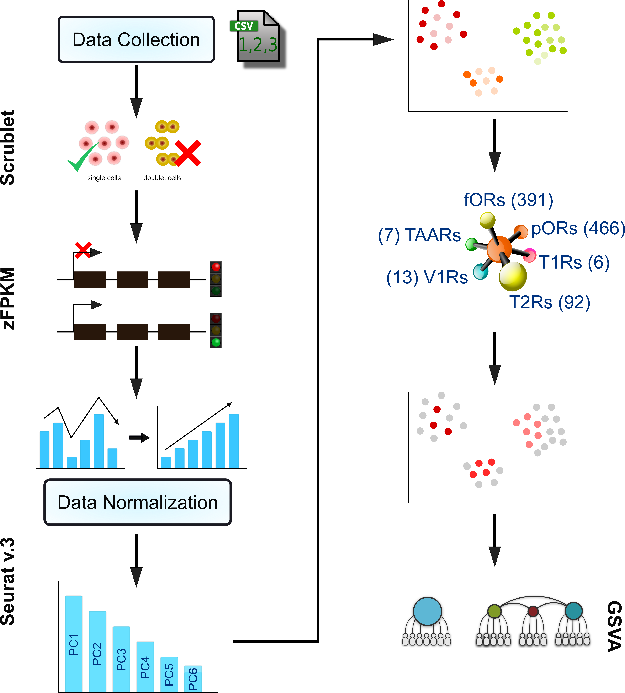

# CancerSmell
## Workflow


**Load essential Libraries** <br/>
The initial step is to load all the necessary libraries

```r
#Loading Essential Libraries
library("reticulate") #To use one Python Library "Scrublet"
library("AnnotationDbi") #To convert one Id to Another
library("org.Hs.eg.db") #To use Genome wide annotation for Human
library(dplyr) #For Datasets Manipulation
library(tidyr) #For Datasets Manipulation
library(data.table) #For Datasets Manipulation
library(zFPKM) #To calulate zFPKM scores
library(Seurat) #For single cell analysis
library(ggplot2) #To plot graphs
library(RColorBrewer) #To define color-palette
library("GSVA") #To compute Gene Set Variation Analysis
library(GSEABase) #To compute Gene Set Variation Analysis
library(GSVAdata) #To compute Gene Set Variation Analysis
library(msigdb) #To load gmt file
```

Once all the libraries are properly loaded, we need to provide input files. This pipeline takes into account 6 sub famlies of GPCRs. The format of all these 6 Input Files is a sinlge column csv file that contains **gene names** as entries and column heading as **"Symbol"**  <br/>

**Input Receptor files** <br/>
```r
f_or<-read.csv("Main_pipeline/Receptor_files/functional_or.csv",header=TRUE)
p_or<-read.csv("Main_pipeline/Receptor_files/pseudo_or.csv",header=TRUE)
t1r<-read.csv("Main_pipeline/Receptor_files/t1r.csv",header=TRUE)
t2r<-read.csv("Main_pipeline/Receptor_files/t2r.csv",header=TRUE)
taar<-read.csv("Main_pipeline/Receptor_files/taar.csv",header=TRUE)
v1r<-read.csv("Main_pipeline/Receptor_files/v1r.csv",header=TRUE)
```

**Loading Expression file** <br/>
In this documntation, the sample file used is under **GSE75688** folder. The structure of the file is shown below.

| __CellName__ | __SRR2973279__ | __SRR2973280__ | __SRR2973281__ | __SRR2973282__ | __SRR2973283__ |
|-------------|------------|------------|------------|------------|------------|
| Sample         | BC01     | BC01     | BC01     | BC01     | BC01     |
| ENSG00000000003        | 0.76869 | 0.625649     | 0.546056     |  0.743321     | 0.163526    |
| ENSG00000000005         | 0 | 0     | 0     |  0     | 0    |
| ENSG00000000457         | 2.333028 | 0.593446     | 68.046238     |  8.740911     | 61.360909   |

```r
#Reading Raw tpm matrix
exp<-read.csv("Main_pipeline/GSE75688/GSE75688_PCG_beforeQC.txt",header=TRUE,
               row.names=1,sep="\t",stringsAsFactors=FALSE)
```

**File Manipulation** <br/>
Since the first row contains non-numneric values, the first line of the file was removed.

```r
exp<-exp[-1,]
```

Now our file appears like this 

| __CellName__ | __SRR2973279__ | __SRR2973280__ | __SRR2973281__ | __SRR2973282__ | __SRR2973283__ |
|-------------|------------|------------|------------|------------|------------|
| ENSG00000000003        | 0.76869 | 0.625649     | 0.546056     |  0.743321     | 0.163526    |
| ENSG00000000005         | 0 | 0     | 0     |  0     | 0    |
| ENSG00000000457         | 2.333028 | 0.593446     | 68.046238     |  8.740911     | 61.360909   |

The Gene Id's present in this input file is in ENSEMBL format whereas our receptor file contains gene names. So we need to convert these ENSEMBL ID's to Gene Names

```r
exp$Gene <- mapIds(org.Hs.eg.db,keys=row.names(exp),column="SYMBOL", keytype="ENSEMBL", multiVals="first")
exp<-distinct(exp,Gene, .keep_all= TRUE)
exp<-exp %>% drop_na(Gene)
row.names(exp)<-exp$Gene
exp$Gene<-NULL
t_exp<-t(exp)
t_exp<-as.data.frame(t_exp)
```
After ID conversion file will apper like this.

| __CellName__ | __SRR2973279__ | __SRR2973280__ | __SRR2973281__ | __SRR2973282__ | __SRR2973283__ |
|-------------|------------|------------|------------|------------|------------|
| TSPAN6       | 0.76869 | 0.625649     | 0.546056     |  0.743321     | 0.163526    |
| TNMD         | 0 | 0     | 0     |  0     | 0    |
| DPM1         | 2.333028 | 0.593446     | 68.046238     |  8.740911     | 61.360909   |

**Saving Files**
```r
exp<-setDT(exp, keep.rownames = "Gene_names")[]
write.table(exp,file="Main_pipeline/GSE75688/raw_input.csv",sep=",",quote=FALSE,row.names = FALSE,col.names = TRUE)
t_exp<-setDT(t_exp, keep.rownames = "Cell_names")[]
write.table(t_exp,file="Main_pipeline/GSE75688/raw_input_for_doublet.csv",sep=",",quote=FALSE,
            row.names = FALSE,col.names = TRUE)
```

**Doublet Identification** <br/>
For this purpose python package *"Scrublet"* (0.2.1) was used.

```python
import pandas as pd
import numpy as np
import scrublet as scr
data = pd.io.parsers.read_csv("Main_pipeline/GSE75688/raw_input_for_doublet.csv",sep=",",index_col=0)
indexNamesArr = data.index.values
listOfRowIndexLabels = list(indexNamesArr)
listOfRowIndexLabels
row_names=pd.DataFrame(listOfRowIndexLabels)
scrub = scr.Scrublet(data)
doublet_scores, predicted_doublets = scrub.scrub_doublets()
score=pd.DataFrame(doublet_scores)
value=pd.DataFrame(predicted_doublets)
a=np.concatenate((row_names,score),axis=1)
b=np.concatenate((a,value),axis=1)
final=pd.DataFrame(b)
final.columns = ['Cell','Doublet_Score','Doublet']
print(final)
final.to_csv(r'Main_pipeline/GSE75688/doublet_analysis.csv',index = None, header=True)
exit()
```

**Alternatively** the above code has been saved in the file *doublet.py* and can be called in R only using **reticulate()** library. For this you need to pass the location where your python is installed in the function *use_python*. For eg

```r
use_python("/home/siddhant18241/miniconda3/bin/python3", required = T)
py_config()
source_python("Main_pipeline/GSE75688/doublet.py")
```
Doublet Analysis will output the result in "doublet_analysis.csv".
This is the three column file that contains Cell_Id, Doublet_Score, and Doublet_Status

| __Cell__ | __Doublet_Score__ | __Doublet__ |
|-------------|------------|------------|
| SRR2973279      | 0.02072538860103627 | False     |
| SRR2973280       | 0.017369727047146403 | False     |
| SRR2973281       | 0.017369727047146403 | False     |

Doublet Status will be in the form of **TRUE/FALSE**, only **FALSE** cells are further used for analysis.

```r
doublet<-read.csv("Main_pipeline/GSE75688/doublet_analysis.csv")
doublet<-subset(doublet, Doublet=="False" )
doublet$Doublet_Score<-NULL
doublet$Doublet<-NULL
doublets_removed<-merge(doublet,t_exp,by.x="Cell",by.y="Cell_names")
row.names(doublets_removed)<-doublets_removed[,1]
doublets_removed$Cell<-NULL
t_doublets_removed<-t(doublets_removed)
t_doublets_removed<-as.data.frame(t_doublets_removed)
t_doublets_removed<-setDT(t_doublets_removed, keep.rownames = "Gene_names")[]
write.table(t_doublets_removed,file="Main_pipeline/GSE75688/Doublets_removed.csv",sep=",",row.names=FALSE,col.names = TRUE,quote=FALSE)
```

To save space the variables that don't have any role now are assigned a NULL value.

```r
exp<-NULL
t_exp<-NULL
doublet<-NULL
doublets_removed<-NULL
t_doublets_removed<-NULL
```
The next step in the analysis is to identify the active and inactive genes based on their zFPKM values.

```r
num_data<-read.csv("Main_pipeline/GSE75688/Doublets_removed.csv",row.names = 1)
zfpkm<-zFPKM(num_data, assayName = "tpm")
zfpkm<-as.data.frame(zfpkm)
zfpkm$Median_Value <- apply(zfpkm, 1, FUN=median, na.rm=TRUE)
```

Active genes are only those genes that have Median of zFPKM value >-3

```r
filtered_genes<-subset(zfpkm, Median_Value>=-3 )
filtered_genes$Median_Value<-NULL
list_of_filtered_genes<-row.names(filtered_genes)
list_of_filtered_genes<-as.data.frame(list_of_filtered_genes)
colnames(list_of_filtered_genes)<-c("Gene_names")
```

Since num_data contains all genes and only non doublet cells, we need to select only those genes which has median value >-3.
```r
num_data<-as.data.frame(num_data)
num_data<-setDT(num_data, keep.rownames = "Gene_names")[]
seurat_input<-merge(list_of_filtered_genes,num_data,by.x="Gene_names",by.y="Gene_names")
write.table(seurat_input,file="Main_pipeline/GSE75688/seurat_input.csv",row.names=FALSE,
            col.names = TRUE,sep=",",quote = FALSE)
row.names(seurat_input)<-seurat_input$Gene_names
seurat_input$Gene_names<-NULL
```
filtered_genes was also intersected with zfpkm
```r
zfpkm<-as.data.frame(zfpkm)
zfpkm<-setDT(zfpkm, keep.rownames = "Gene_names")[]
active_zfpkm_genes<-merge(list_of_filtered_genes,zfpkm,by.x="Gene_names",by.y="Gene_names")
active_zfpkm_genes$Median_Value<-NULL
write.table(active_zfpkm_genes,file="Main_pipeline/GSE75688/Active_genes_zfpkm_values.csv",row.names=FALSE,col.names = TRUE,sep=",",quote = FALSE)
```

Only seurat_input and active_zfpk_genes will be further used in the analysis.
To reduce space again we removed the outdated variables.
```r
num_data<-NULL
zfpkm<-NULL
filtered_genes<-NULL
list_of_filtered_genes<-NULL
```

**SEURAT_implementation** <br>
Creating seurat object
```r
pb <- CreateSeuratObject(counts = seurat_input, min.cells = 3, min.features = 200)
pb
```

Generating several plots
```r
VlnPlot(pb, features = c("nFeature_RNA", "nCount_RNA"), ncol = 2)
 plot2 <- FeatureScatter(pb, feature1 = "nCount_RNA", feature2 = "nFeature_RNA")
 plot(plot2)
 ```

Since we used raw matrix we need to perform normalization
```r
pb <- NormalizeData(pb)
pb <- FindVariableFeatures(pb, selection.method = "vst", nfeatures = 2000)
list_of_variable_features<-VariableFeatures(pb)
list_of_variable_features<-as.data.frame(list_of_variable_features)
write.table(list_of_variable_features,file="Main_pipeline/GSE75688/List_of_variable_features.csv",
            sep=",",row.names=FALSE,quote = FALSE)
```

Further analysis: Scaling of data
```r
all.genes <- rownames(pb)
pb <- ScaleData(pb, features = all.genes)
```

Dimension Reduction
```r
pb <- RunPCA(pb, features = VariableFeatures(object = pb))
VizDimLoadings(pb, dims = 1:2, reduction = "pca")
DimPlot(pb, reduction = "pca")
```
Plotting HeatMap

```r
DimHeatmap(pb, dims = 1:15, cells = 500, balanced = TRUE)
pb <- JackStraw(pb, num.replicate = 100)
pb <- ScoreJackStraw(pb, dims = 1:20)
JackStrawPlot(pb, dims = 1:15)
ElbowPlot(pb)
```

Finding Neighbours and perforimg Cluster analysis

```r
pb <- FindNeighbors(pb, dims = 1:10)
pb <- FindClusters(pb, resolution = 0.5)
head(Idents(pb), 5)
pb <- RunUMAP(pb, dims = 1:10)
DimPlot(pb, reduction = "umap")
```


Finding Markers of all clusters
```r
pb.markers <- FindAllMarkers(pb, only.pos = TRUE, min.pct = 0.25, logfc.threshold = 0.25)
write.table(pb.markers,file="Main_pipeline/GSE75688/Markers_info.csv",
            sep=",",row.names=FALSE,col.names = TRUE,quote = FALSE)
row_names<-row.names(seurat_input)
row_names<-as.data.frame(row_names)
seurat_input_copy<-seurat_input
seurat_input_copy<-setDT(seurat_input_copy, keep.rownames = TRUE)[]
write.table(seurat_input_copy,file="Main_pipeline/GSE75688/copy_of_seu_input.csv",
            sep=",",quote=FALSE,row.names = FALSE,col.names = TRUE)
```

Plotting UMAPS for FUNCTIONAL ORs detected.
```r
factor0<-merge(row_names,f_or,by.x="row_names",by.y="Symbol")
factor0<-as.matrix(factor0)
a<-length(factor0)
for (j in 1:a){
  tryCatch(
    {
      
      k<-FeaturePlot(pb, features = c(factor0[j,]),cols=my_col)
      plot(k)
      
    },
    error=function(cond) {
      message(paste("."))
      
    },
    warning=function(cond) {
      message(paste("."))
      
    },
    finally={
      
    }
  )    
}
```
For example, one of the UMAP is shown below.


```r
check<-Idents(pb)
check<-as.data.frame(check)
#Converting row names as first column  
check<-setDT(check, keep.rownames = TRUE)[]
#Assigning column names to check
colnames(check)<- c("Ids","Cluster")
x<-merge(f_or,seurat_input_copy,by.x="Symbol",by.y="rn")
first_col<-x[,1]
first_col<-as.matrix(first_col)
t_comb<-t(x)
t_comb<-as.data.frame(t_comb)
t_comb<-setDT(t_comb, keep.rownames = TRUE)[]
names(t_comb) <- as.matrix(t_comb[1,])
t_comb <- t_comb[-1,]
Functional_Olfactory_info<-merge(check,t_comb,by.x="Ids",by.y="Symbol")
write.table(Functional_Olfactory_info,"Main_pipeline/GSE75688/Functional_Olfactory_info.csv",
            row.names=FALSE,sep=",",quote = FALSE)
x<-NULL
Functional_Olfactory_info<-as.data.frame(Functional_Olfactory_info)
row.names(Functional_Olfactory_info)<-Functional_Olfactory_info$Ids
Functional_Olfactory_info$Ids<-NULL
Functional_Olfactory_info<-t(Functional_Olfactory_info)
Functional_Olfactory_info<-as.data.frame(Functional_Olfactory_info)
```

Similar work was done for TAAR, VIR, V2R, TIR and Pseudo ORs

```r
#Plotting UMAPS for TAARs detected.
factor0<-merge(row_names,taar,by.x="row_names",by.y="Symbol")
factor0<-as.matrix(factor0)
a<-length(factor0)
pdf(file="Main_pipeline/GSE756881/UMAP_TAAR_plots.pdf")
for (j in 1:a){
  tryCatch(
    {
      
      k<-FeaturePlot(pb, features = c(factor0[j,]),cols=my_col)
      plot(k)
      
    },
    error=function(cond) {
      message(paste("."))
      
    },
    warning=function(cond) {
      message(paste("."))
      
    },
    finally={
      
    }
  )    
}
dev.off()

check<-Idents(pb)
check<-as.data.frame(check)
#Converting row names as first column  
check<-setDT(check, keep.rownames = TRUE)[]
#Assigning column names to check
colnames(check)<- c("Ids","Cluster")
x<-merge(taar,seurat_input_copy,by.x="Symbol",by.y="rn")
first_col<-x[,1]
first_col<-as.matrix(first_col)
t_comb<-t(x)
t_comb<-as.data.frame(t_comb)
t_comb<-setDT(t_comb, keep.rownames = TRUE)[]
names(t_comb) <- as.matrix(t_comb[1,])
t_comb <- t_comb[-1,]
Functional_TAAR_info<-merge(check,t_comb,by.x="Ids",by.y="Symbol")
write.table(Functional_TAAR_info,"Main_pipeline/GSE756881/Functional_TAAR_info.csv",row.names=FALSE,sep=",",quote = FALSE)
x<-NULL
Functional_TAAR_info<-as.data.frame(Functional_TAAR_info)
row.names(Functional_TAAR_info)<-Functional_TAAR_info$Ids
Functional_TAAR_info$Ids<-NULL
Functional_TAAR_info<-t(Functional_TAAR_info)
Functional_TAAR_info<-as.data.frame(Functional_TAAR_info)


#___________________________________________________________________________________
#Plotting UMAPS for V1Rs detected.
factor0<-merge(row_names,v1r,by.x="row_names",by.y="Symbol")
factor0<-as.matrix(factor0)
a<-length(factor0)
pdf(file="Main_pipeline/GSE756881/UMAP_V1R_plots.pdf")
for (j in 1:a){
  tryCatch(
    {
      
      k<-FeaturePlot(pb, features = c(factor0[j,]),cols=my_col)
      plot(k)
      
    },
    error=function(cond) {
      message(paste("."))
      
    },
    warning=function(cond) {
      message(paste("."))
      
    },
    finally={
      
    }
  )    
}
dev.off()

check<-Idents(pb)
check<-as.data.frame(check)
#Converting row names as first column  
check<-setDT(check, keep.rownames = TRUE)[]
#Assigning column names to check
colnames(check)<- c("Ids","Cluster")
x<-merge(v1r,seurat_input_copy,by.x="Symbol",by.y="rn")
first_col<-x[,1]
first_col<-as.matrix(first_col)
t_comb<-t(x)
t_comb<-as.data.frame(t_comb)
t_comb<-setDT(t_comb, keep.rownames = TRUE)[]
names(t_comb) <- as.matrix(t_comb[1,])
t_comb <- t_comb[-1,]
Functional_V1R_info<-merge(check,t_comb,by.x="Ids",by.y="Symbol")
write.table(Functional_V1R_info,"Main_pipeline/GSE756881/Functional_V1R_info.csv",row.names=FALSE,sep=",",quote = FALSE)
x<-NULL
Functional_V1R_info<-as.data.frame(Functional_V1R_info)
row.names(Functional_V1R_info)<-Functional_V1R_info$Ids
Functional_V1R_info$Ids<-NULL
Functional_V1R_info<-t(Functional_V1R_info)
Functional_V1R_info<-as.data.frame(Functional_V1R_info)

#___________________________________________________________________________________
#Plotting UMAPS for T2Rs detected.
factor0<-merge(row_names,t2r,by.x="row_names",by.y="Symbol")
factor0<-as.matrix(factor0)
a<-length(factor0)
pdf(file="Main_pipeline/GSE756881/UMAP_T2R_plots.pdf")
for (j in 1:a){
  tryCatch(
    {
      
      k<-FeaturePlot(pb, features = c(factor0[j,]),cols=my_col)
      plot(k)
      
    },
    error=function(cond) {
      message(paste("."))
      
    },
    warning=function(cond) {
      message(paste("."))
      
    },
    finally={
      
    }
  )    
}
dev.off()

check<-Idents(pb)
check<-as.data.frame(check)
#Converting row names as first column  
check<-setDT(check, keep.rownames = TRUE)[]
#Assigning column names to check
colnames(check)<- c("Ids","Cluster")
x<-merge(t2r,seurat_input_copy,by.x="Symbol",by.y="rn")
first_col<-x[,1]
first_col<-as.matrix(first_col)
t_comb<-t(x)
t_comb<-as.data.frame(t_comb)
t_comb<-setDT(t_comb, keep.rownames = TRUE)[]
names(t_comb) <- as.matrix(t_comb[1,])
t_comb <- t_comb[-1,]
Functional_T2R_info<-merge(check,t_comb,by.x="Ids",by.y="Symbol")
write.table(Functional_T2R_info,"Main_pipeline/GSE756881/Functional_T2R_info.csv",row.names=FALSE,sep=",",quote = FALSE)
x<-NULL
Functional_T2R_info<-as.data.frame(Functional_T2R_info)
row.names(Functional_T2R_info)<-Functional_T2R_info$Ids
Functional_T2R_info$Ids<-NULL
Functional_T2R_info<-t(Functional_T2R_info)
Functional_T2R_info<-as.data.frame(Functional_T2R_info)

#___________________________________________________________________________________
#Plotting UMAPS for T1Rs detected.
factor0<-merge(row_names,t1r,by.x="row_names",by.y="Symbol")
factor0<-as.matrix(factor0)
a<-length(factor0)
pdf(file="Main_pipeline/GSE756881/UMAP_T1R_plots.pdf")
for (j in 1:a){
  tryCatch(
    {
      
      k<-FeaturePlot(pb, features = c(factor0[j,]),cols=my_col)
      plot(k)
      
    },
    error=function(cond) {
      message(paste("."))
      
    },
    warning=function(cond) {
      message(paste("."))
      
    },
    finally={
      
    }
  )    
}
dev.off()

check<-Idents(pb)
check<-as.data.frame(check)
#Converting row names as first column  
check<-setDT(check, keep.rownames = TRUE)[]
#Assigning column names to check
colnames(check)<- c("Ids","Cluster")
x<-merge(t1r,seurat_input_copy,by.x="Symbol",by.y="rn")
first_col<-x[,1]
first_col<-as.matrix(first_col)
t_comb<-t(x)
t_comb<-as.data.frame(t_comb)
t_comb<-setDT(t_comb, keep.rownames = TRUE)[]
names(t_comb) <- as.matrix(t_comb[1,])
t_comb <- t_comb[-1,]
Functional_T1R_info<-merge(check,t_comb,by.x="Ids",by.y="Symbol")
write.table(Functional_T1R_info,"Main_pipeline/GSE756881/Functional_T1R_info.csv",row.names=FALSE,sep=",",quote = FALSE)
x<-NULL
Functional_T1R_info<-as.data.frame(Functional_T1R_info)
row.names(Functional_T1R_info)<-Functional_T1R_info$Ids
Functional_T1R_info$Ids<-NULL
Functional_T1R_info<-t(Functional_T1R_info)
Functional_T1R_info<-as.data.frame(Functional_T1R_info)

#___________________________________________________________________________________
#Plotting UMAPS for Pseudo ORs detected.
factor0<-merge(row_names,p_or,by.x="row_names",by.y="Symbol")
factor0<-as.matrix(factor0)
a<-length(factor0)
pdf(file="Main_pipeline/GSE756881/UMAP_Pseudo_Olfactory_plots.pdf")
for (j in 1:a){
  tryCatch(
    {
      
      k<-FeaturePlot(pb, features = c(factor0[j,]),cols=my_col)
      plot(k)
      
    },
    error=function(cond) {
      message(paste("."))
      
    },
    warning=function(cond) {
      message(paste("."))
      
    },
    finally={
      
    }
  )    
}
dev.off()

check<-Idents(pb)
check<-as.data.frame(check)
#Converting row names as first column  
check<-setDT(check, keep.rownames = TRUE)[]
#Assigning column names to check
colnames(check)<- c("Ids","Cluster")
x<-merge(p_or,seurat_input_copy,by.x="Symbol",by.y="rn")
first_col<-x[,1]
first_col<-as.matrix(first_col)
t_comb<-t(x)
t_comb<-as.data.frame(t_comb)
t_comb<-setDT(t_comb, keep.rownames = TRUE)[]
names(t_comb) <- as.matrix(t_comb[1,])
t_comb <- t_comb[-1,]
Functional_Pseudo_olfactory_info<-merge(check,t_comb,by.x="Ids",by.y="Symbol")
write.table(Functional_Pseudo_olfactory_info,"Main_pipeline/GSE756881/Functional_Pseudo_olfactory_info.csv",row.names=FALSE,sep=",",quote = FALSE)
x<-NULL
Functional_Pseudo_olfactory_info<-as.data.frame(Functional_Pseudo_olfactory_info)
row.names(Functional_Pseudo_olfactory_info)<-Functional_Pseudo_olfactory_info$Ids
Functional_Pseudo_olfactory_info$Ids<-NULL
Functional_Pseudo_olfactory_info<-t(Functional_Pseudo_olfactory_info)
Functional_Pseudo_olfactory_info<-as.data.frame(Functional_Pseudo_olfactory_info)
```

Combining all the data frames together, to obatin a final complete Dataframe.
```r
final<-do.call("rbind", list(Functional_Olfactory_info,Functional_Pseudo_olfactory_info,Functional_T1R_info,Functional_T2R_info,Functional_TAAR_info,Functional_V1R_info))
remove<-list("Cluster1", "Cluster2", "Cluster3", "Cluster4", "Cluster5")
final = final[ !(rownames(final) %in% remove), ]
selected_receptors<-row.names(final)
selected_receptors<-as.data.frame(selected_receptors)
selected_receptors<-selected_receptors[-1,]
selected_receptors<-as.data.frame(selected_receptors)
final<-t(final)
final<-as.data.frame(final)
final<-setDT(final, keep.rownames = "Cell_Ids")[]
write.table(final,file="Main_pipeline/GSE756881/Final_Receptor_file.csv",sep=",",row.name=FALSE,col.names = TRUE,quote=FALSE)
```

Another task is to classify the cell as Negative or Positive based on the expression of ORs.
```r
selected_rep_zfpkm_values<-merge(selected_receptors,active_zfpkm_genes,by.x="selected_receptors",by.y="Gene_names")
row.names(selected_rep_zfpkm_values)<-selected_rep_zfpkm_values$selected_receptors
selected_rep_zfpkm_values$selected_receptors<-NULL
selected_rep_zfpkm_values<-t(selected_rep_zfpkm_values)
selected_rep_zfpkm_values<-as.data.frame(selected_rep_zfpkm_values)
selected_rep_zfpkm_values$count_value<-apply(selected_rep_zfpkm_values,1,function(x) sum(x>=-3))
selected_rep_zfpkm_values$Cell_status<-ifelse(selected_rep_zfpkm_values$count_value>0,"Positive","Negative")
selected_rep_zfpkm_values<-setDT(selected_rep_zfpkm_values, keep.rownames = "Cell_Ids")[]
write.table(selected_rep_zfpkm_values,file="Main_pipeline/GSE756881/Cell_staus_zfpkm.csv",sep=",",row.names=FALSE,col.names = TRUE,quote=FALSE)
```

Gene Set Variation Analysis
```r
input<-read.csv("Main_pipeline/GSE756881/copy_of_seu_input.csv")
mer<-merge(selected_receptors,input,by.x="selected_receptors",by.y="rn")
row.names(mer) <- mer$selected_receptors
mer[1] <- NULL
row.names(input) <- input$rn
input[1] <- NULL
input<-as.matrix(input)

#Input GMT file
genelist_mic <- getGmt("GMT_file/GMT_file_for_GSVA.gmt")
gbm_es <- gsva(input, genelist_mic)
gbm_es<-as.data.frame(gbm_es)
df=data.frame(matrix(ncol=4,nrow=0))
colnames(df)<-c("Genename","Signature","Pvalue","Corelation")
for (i in 1:nrow(mer)){
  p<-as.matrix(mer[i,])
  for (j in 1:nrow(gbm_es)){
    q<-as.matrix(gbm_es[j,])
    result<-cor.test(p,q)
    com<-c(row.names(p),row.names(q),result[["p.value"]],result[["estimate"]][["cor"]])
    df[nrow(df)+1,]=com
  }
}
df<-filter(df, Pvalue <= 0.01)
write.table(df,file="Main_pipeline/GSE756881/GSVA_signatures.csv", sep=",", row.names = FALSE, col.names = TRUE, quote = FALSE)
df
gbm_es_2<-gbm_es
gbm_es_2<-setDT(gbm_es_2,keep.rownames = "Signature")[]
write.table(gbm_es_2,file="Main_pipeline/GSE756881/GSVA_scores.csv",sep=",",row.names=FALSE,col.names=TRUE,quote=FALSE)
```
The GSVA results will be similar to the table shown below

| __Gene Name__ | __Signature__ | __P-Value__ | __Correlation__ |
|-------------|------------|------------|------------|
| OR6C75     | Differentiation | 0.0001542391263     | 0.21    |
| OR8H1       | Angiogenesis | 0.0003532790554     | 0.20    |
| OR8H1      | Invasion | 0.0001711976409    | -0.21    |
| OR7G2      | DNA_repair | 0.0001577398186     | -0.21    |
| OR1A1      | Inflammation | 0.009691620452     | -0.33    |

